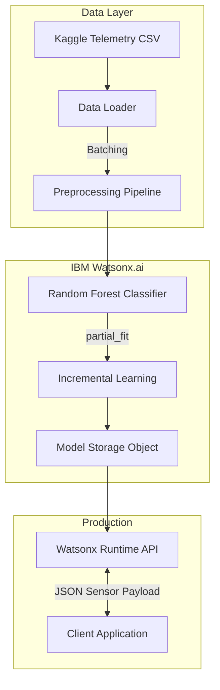

# Predictive Maintenance ML System

> An end-to-end industrial machine failure prediction system using real-time sensor data and Random Forest classification.

[Repository](https://github.com/Tusharkapoor-oop/IBM-Cloud-project)

---

## ◈ Overview

Industrial equipment such as CNC machines and industrial motors are susceptible to unexpected failures from tool wear, power fluctuations, and thermal overload. 

This project implements a predictive maintenance pipeline that forecasts specific failure types before they occur. Trained and deployed entirely on **IBM Watsonx.ai**, the system analyzes 10,000+ data points of real-time sensor telemetry to enable data-driven, proactive maintenance scheduling.

---

## ◈ Architecture

The system utilizes an incremental learning approach, allowing the model to be partially fitted (updated) with new batch data without requiring a full retraining cycle.



---

## ◈ Key Engineering Decisions

### 1. Incremental Learning (partial_fit)
**Problem:** Industrial sensors generate massive amounts of continuous data. Retraining a model on the entire historical dataset every day is computationally expensive.
**Solution:** The system utilizes scikit-learn's `partial_fit` via the `lale` pipeline to incrementally train the Random Forest ensemble on new data batches in real-time.

### 2. AutoAI Pipeline Optimization
**Problem:** Selecting the right hyper-parameters for unbalanced failure datasets is time-consuming.
**Solution:** Utilized IBM Watson AutoAI to benchmark multiple tree-ensemble classifiers, ultimately selecting a BatchedTreeEnsembleClassifier optimized for the `accuracy` scoring metric on highly imbalanced failure classes.

---

## ◈ Tech Stack

**Model & Pipeline**
- `Python 3.11`
- `Scikit-learn` / `SnapML`
- `lale` (Pipeline Architecture)
- `Pandas` / `NumPy`

**Infrastructure & Deployment**
- `IBM Watsonx.ai Studio` (Notebooks & AutoAI)
- `IBM Watsonx.ai Runtime` (REST API Deployment)
- `IBM Cloud Object Storage`

---

## ◈ Performance Metrics

- **Algorithm:** BatchedTreeEnsembleClassifier (Random Forest)
- **Features:** Torque, Voltage, Temperature, Vibration, Rotational Speed
- **Target Classes:** Heat Dissipation Failure, Power Failure, Overstrain Failure, Tool Wear, Random Failure
- **Accuracy:** ~91%
- **Latency:** Millisecond-level inference via Watson REST API

---

## ◈ Getting Started

### Requirements
- IBM Cloud Account (Watsonx.ai enabled)
- Python 3.11+
- Jupyter Environment

### Setup

1. **Clone the repository**
```bash
git clone https://github.com/Tusharkapoor-oop/IBM-Cloud-project.git
cd IBM-Cloud-project
```

2. **Install Dependencies**
```bash
pip install ibm-watsonx-ai autoai-libs scikit-learn snapml lale
```

3. **Run the Notebook**
Open `Predictive Maintance ML file Tushar.ipynb` and provide your IBM Cloud API key when prompted by the `getpass` cell to authenticate with your workspace.

---

## ◈ Limitations & Future Work

- **Time-Series Dependencies:** The current Random Forest model evaluates each sensor reading independently. Future iterations should implement LSTMs to capture sequential degradation over time.
- **Remaining Useful Life (RUL):** The model currently predicts binary failure states. Expanding this to predict the exact RUL (in hours) would increase industrial utility.

---

## ◈ License

Data and notebook structures subject to IBM Cloud ILAN License terms. Code modifications distributed under MIT.
