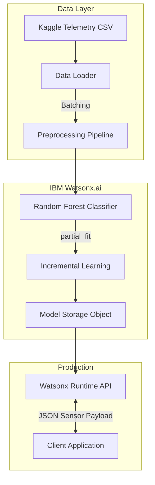

# Predictive Maintenance ML System

> An end-to-end industrial machine failure prediction system using real-time sensor data and Random Forest classification, trained and deployed on **IBM Watsonx.ai**.

[Repository](https://github.com/Tusharkapoor-oop/IBM-Cloud-project)

---

## Overview

Industrial equipment such as CNC machines and industrial motors are susceptible to unexpected failures from tool wear, power fluctuations, and thermal overload.

This project implements a predictive maintenance pipeline that forecasts specific failure types before they occur. Trained and deployed entirely on IBM Watsonx.ai, the system analyzes 10,000+ data points of real-time sensor telemetry to enable data-driven, proactive maintenance scheduling.

---

## Architecture

The system uses an incremental learning approach — the model can be partially fitted (updated) with new batch data without full retraining.



---

## Key Engineering Decisions

### 1. Incremental Learning (partial_fit)
**Problem:** Industrial sensors generate massive amounts of continuous data. Retraining on the full historical dataset daily is computationally expensive.
**Solution:** scikit-learn `partial_fit` via the `lale` pipeline incrementally trains the Random Forest ensemble on new data batches.

### 2. AutoAI Pipeline Optimization
**Problem:** Hyperparameter selection for unbalanced failure classes is slow and error-prone.
**Solution:** IBM Watson AutoAI benchmarked tree-ensemble candidates; the selected `BatchedTreeEnsembleClassifier` optimizes `accuracy` on highly imbalanced failure classes.

---

## Repository layout

```
Predictive Maintance ML file Tushar.ipynb   # main notebook (filename typo kept for
                                            # link stability; rename planned)
predictive_maintenance.csv                  # Kaggle telemetry dataset (531 KB)
Project_ppt_ AICTE.pptx                     # project presentation
README.md
```

---

## Tech Stack

**Model & Pipeline**
- Python 3.11 · Scikit-learn / SnapML · `lale` (pipeline architecture) · Pandas / NumPy

**Infrastructure & Deployment**
- IBM Watsonx.ai Studio (Notebooks & AutoAI) · Watsonx.ai Runtime (REST deployment) · Cloud Object Storage

---

## Performance Metrics

- **Algorithm:** BatchedTreeEnsembleClassifier (Random Forest)
- **Features:** Torque, Voltage, Temperature, Vibration, Rotational Speed
- **Target Classes:** Heat Dissipation Failure · Power Failure · Overstrain Failure · Tool Wear · Random Failure
- **Accuracy:** ~91% (reported by the trained model in the notebook — re-run the notebook to reproduce)
- **Latency:** Millisecond-level inference via Watson REST API

---

## Getting Started

### Requirements
- IBM Cloud account (Watsonx.ai enabled)
- Python 3.11+, Jupyter

### Setup

```bash
git clone https://github.com/Tusharkapoor-oop/IBM-Cloud-project.git
cd IBM-Cloud-project

pip install ibm-watsonx-ai autoai-libs scikit-learn snapml lale jupyter
```

Open `Predictive Maintance ML file Tushar.ipynb` and provide your IBM Cloud API key in the `getpass` cell — the key is never written to the notebook file.

> **Notebook hygiene:** the notebook intentionally contains no stored credentials.
> Exported outputs are kept small; the PPTX is documentation, not an input to the pipeline.

---

## Limitations & Future Work

- **Time-Series Dependencies:** the current model evaluates each sensor reading independently; LSTMs would capture sequential degradation.
- **Remaining Useful Life (RUL):** predicts failure states, not time-to-failure — RUL regression is the natural next step.
- **Reproducibility:** full training requires an IBM Cloud account; a local sklearn-only training path is planned so the notebook runs without cloud credentials.

## License

No license file yet — MIT intended (to be added by the repository owner; the current README's license paragraph was removed because no LICENSE file exists).
